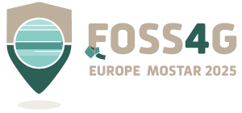
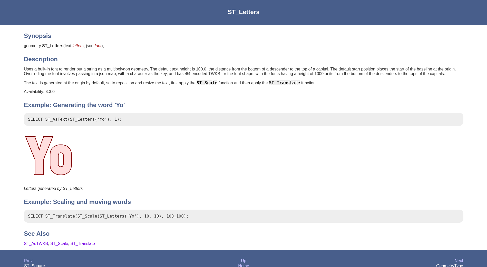
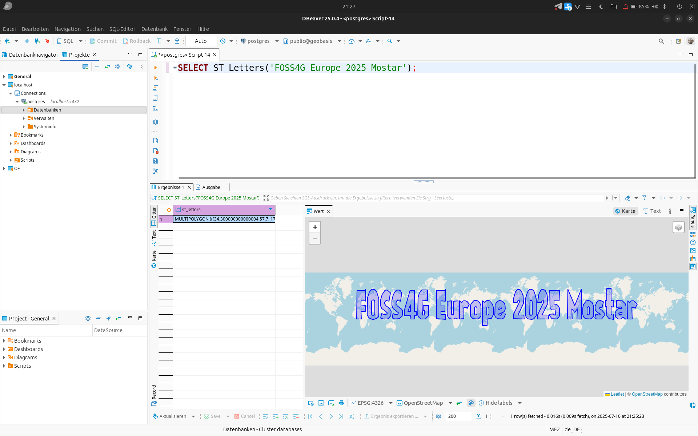
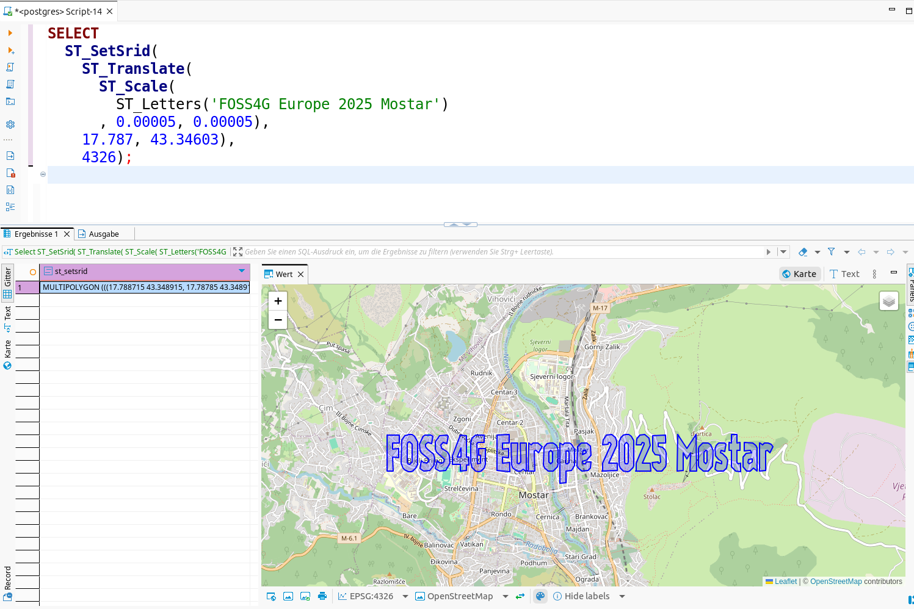
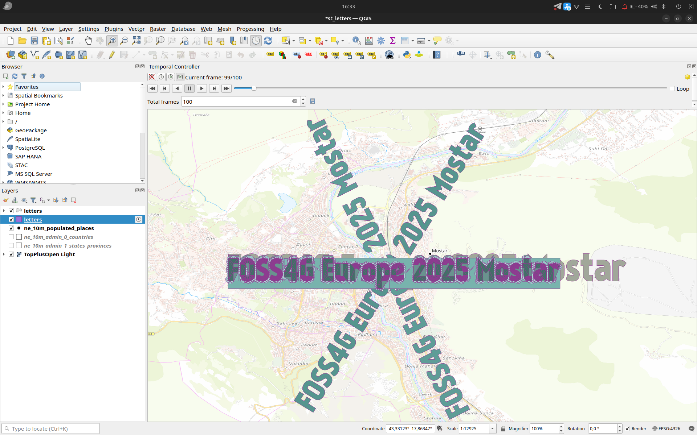
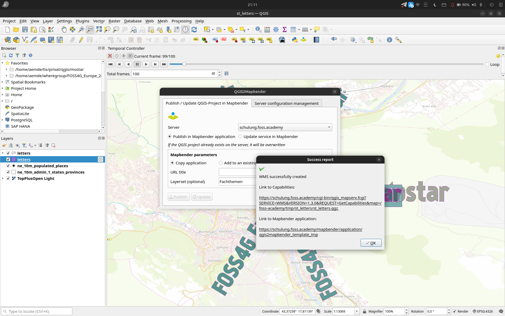
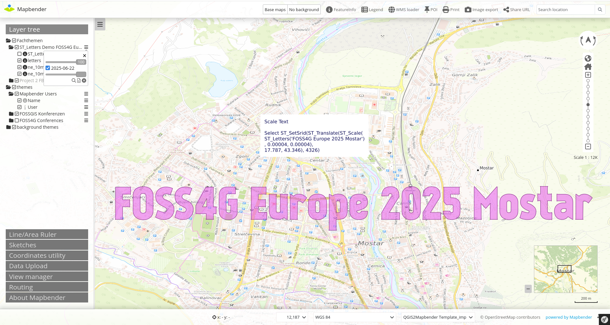

# Discover PostGIS Functions with ST_Letters

[FOSS4G Europe 2025 Mostar (Bosnia-Herzegovina)](https://2025.europe.foss4g.org/)

 


[](https://creativecommons.org/licenses/by-sa/4.0/)


## Astrid Emde

* WhereGroup GmbH Germany
* astrid.emde@wheregroup.com
* [@astroidex fediverse](https://mastodon.social/@astroidex)


* FOSS Academy https://www.foss-academy.com/


## Why ST_Letters? 
* Try PostGIS Functions without data
* ST_Letters >= PostGIS 3.3.0
* Function creates string as a multipolygon geometry
* https://postgis.net/docs/ST_Letters.html




## Try it out!

```sql
SELECT ST_Letters('FOSS4G Europe 2025 Mostar');
```




## Scale the text and move it to Mostar

```sql
SELECT 
  ST_SetSrid(
    ST_Translate(
      ST_Scale(
        ST_Letters('FOSS4G Europe 2025 Mostar')
      , 0.00005, 0.00005),
    17.787, 43.34603), 
    4326);
```




## Try the example in the demo script

* Create database
* Activate the Extension postgis
* Run **script/st_letters_demo.sql** in DBeaver or pgAdmin or psql 
* Have a look at your data in QGIS (try demo project st_letters.qgz - update your .pg_service.conf)


### QGIS




## Video

* Have a look at the video


### Publish QGIS Server WMS and show it in Mapbender







## Making of

* Create demo table with **script/st_letters_demo.sql** Every example represents a day
* QGIS project with **Temporal Controller** on st_letters to show only one demo at once
* Export images via **Temporal Controller**
* Create a video with ffmpeg
* Publish the QGIS project as QGIS Server WMS via the QGIS Plugin QGIS2Mapbender
* Activate Dimensions for the WMS in Mapbender to show only one demo at once


## See also

* Fun with Letters in PostGIS 3.3! Jacob Coblentz Crunchy Data https://www.crunchydata.com/blog/fun-with-letters-in-postgis-33


Have fun with ST_Letters & PostGIS!